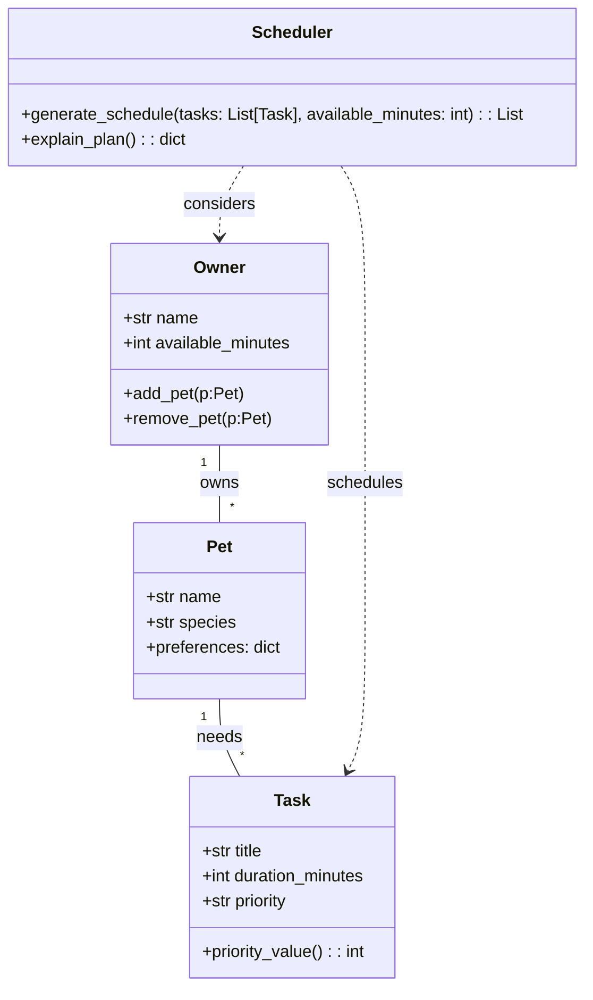

# PawPal+ Project Reflection

## 1. System Design

**System overview & core user actions**

- Core actions a user should be able to perform:
	1. Add and manage pets and owner info (add a pet, set owner availability).
 2. Add/edit tasks with duration and priority (e.g., walk, feed, meds).
 3. Generate and view today's schedule (see ordered tasks, start times, and explanations).

**a. Initial design**

- UML classes: `Owner`, `Pet`, `Task`, `Scheduler`.
	- `Owner`: holds owner metadata and time availability.
	- `Pet`: holds pet metadata (name, species, preferences).
	- `Task`: describes a care task (title, duration_minutes, priority) and helper methods like `priority_value()`.
	- `Scheduler`: responsible for selecting and ordering `Task` objects into a daily plan given constraints.

**Mermaid UML diagram**

**b. Design changes**

- During implementation I split `Task` and `models` into a small `pawpal.models` module for dataclass convenience and created a lightweight `Scheduler` that uses a greedy priority-based algorithm.
- Rationale: start with a simple, testable scheduler and expand later to support preferences and time windows.

---

## 2. Scheduling Logic and Tradeoffs

**a. Constraints and priorities**

- Constraints considered:
	- Total available time per day (owner availability).
	- Task priority (high/medium/low) used to prefer important tasks.
	- Task duration (shorter tasks are preferred as tie-breakers).
	- Task completion status (completed tasks are filtered out by default).
	- Task due time when present (used for sorting/presentation).

	I prioritized time and priority because the owner's available minutes and task importance are the strongest signals for which tasks should be scheduled today.

**b. Tradeoffs**

- Tradeoff: The scheduler uses a simple greedy algorithm (sort by priority then duration) rather than solving a global optimization problem.
	- Reason: This keeps the implementation straightforward and predictable for the user, and is fast for small numbers of daily tasks. It may not always produce a globally optimal schedule (for example, when tasks have complex time windows or dependencies), but it is easier to test and extend.

- Conflict detection tradeoff: the scheduler performs lightweight overlap checking (interval overlap) and returns warnings instead of trying to automatically resolve conflicts.
	- Reason: Automatically reassigning or shifting tasks could surprise the user. Returning warnings is safer and lets the owner make the final decision.

---

## 3. AI Collaboration

**a. How you used AI**

- How did you use AI tools during this project (for example: design brainstorming, debugging, refactoring)?
- What kinds of prompts or questions were most helpful?

**a. How you used AI**

- I used Copilot for iterative tasks: drafting UML (Mermaid), generating class skeletons, suggesting scheduling strategies, and creating tests.
- Helpful prompts included asking for Mermaid class diagrams, requesting Python dataclass skeletons, and asking for small algorithmic snippets (sorting by HH:MM strings, lightweight conflict detection).

**b. Judgment and verification**

- Describe one moment where you did not accept an AI suggestion as-is.
- How did you evaluate or verify what the AI suggested?

**b. Judgment and verification**

- I reviewed every AI suggestion and ran unit tests to verify behavior. If a suggestion introduced complexity or ambiguity (for example, an AI suggestion to auto-resolve conflicts), I rejected it and instead used a warning-based approach for safety.

**Copilot features used**

- Inline code suggestions to scaffold methods.
- File-scoped chat for `#file:pawpal_system.py` to get targeted feedback.
- Test generation suggestions to seed pytest cases I then verified and adjusted.

---

## 4. Testing and Verification

**a. What you tested**

- What behaviors did you test?
- Why were these tests important?

**a. What you tested**

- Sorting: that tasks with `due_time` sort before those without and by chronological order.
- Recurrence: calling `mark_complete()` on a daily task creates the next day's task.
- Conflict detection: scheduler flags overlapping tasks.

These tests ensure the scheduler's key behaviors are reliable and support the UI workflows.

**b. Confidence**

- How confident are you that your scheduler works correctly?
- What edge cases would you test next if you had more time?

---

## 5. Reflection

**a. What went well**

- What part of this project are you most satisfied with?

**a. What went well**

- Converging on a small set of clear, testable scheduling behaviors (priority sorting, time sorting, recurrence, conflict warnings) that made the project predictable and verifiable.

**b. What you would improve**

- Add richer scheduling features: task time windows, user-editable scheduled times, and an optimization-based scheduler for better global fit.

**c. Key takeaway**

- The human-in-the-loop approach matters: AI speeds up scaffolding and brainstorming, but human judgment guided tradeoffs (e.g., prefer warnings over automatic rescheduling).

**AI workflow reflection**

- Using separate Copilot chat sessions per phase helped keep the design, implementation, and testing conversations focused and traceable.
- I rejected a few AI suggestions that attempted automatic conflict resolution because they were too eager and possibly surprising to users.

**b. What you would improve**

- If you had another iteration, what would you improve or redesign?

**c. Key takeaway**

- What is one important thing you learned about designing systems or working with AI on this project?
